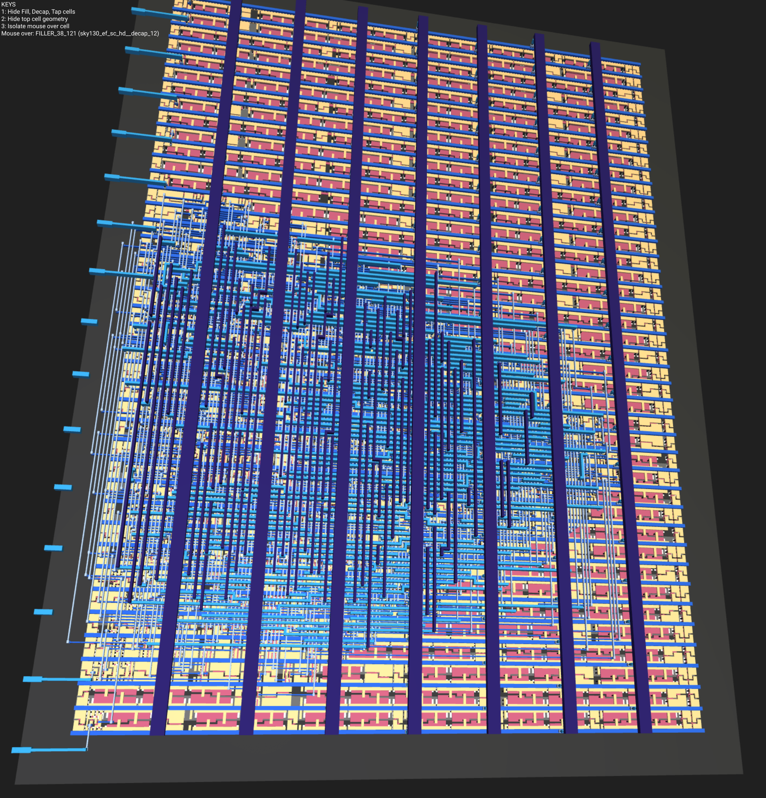
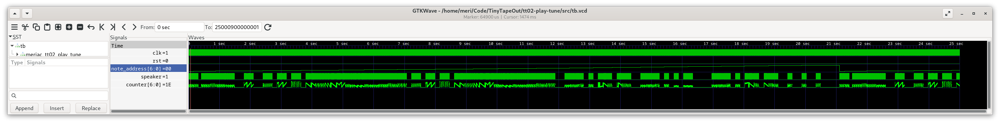
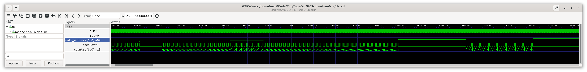

  

# TinyTapeout tt02: Super Mario Tune on A Piezo Speaker #

## Overview ##
[This Verilog chip design](https://meriac.github.io/tt02-play-tune/) is
made for the [TinyTapout tt02 shuttle](https://tinytapeout.com/).
It [will play](src/player.v#L38) the [Super Mario Tune](src/tune.v#L42-L45)
over a Piezo Speaker connected across io_out[1:0]. The speaker is driven
in differential PWM mode to increase its output power.

### Listen To The Generated Sound ###
Listen to the [Verilog Simulation PWM output for 3125Hz clock frequency](https://github.com/meriac/tt02-play-tune/releases/download/v0.5/tune-modulation-verilog-simulated.wav) here.

### Chip Design of the Super Mario Tune player ###

(see also the [interactive version of this design](https://meriac.github.io/tt02-play-tune/))

## Verilog Design Files ##
- [Playback Logic](src/player.v#L38)
- Autogenerated [Super Mario Tune Storage](src/tune.v#L42-L45). This
  project contains a [Python-based script for converting a RTTL ringtone into optimized Verilog](generator/generate.py#L38).
  An additional [script converts TIM-file waveforms from the Verilog simulator back to a WAV-sound file](generator/tim2wav-test.py#L38)
  to verify the correctness of the hardware-based player's sound.

### Waveform of Verilog Simulation Output ###
Using [GTKWave](https://gtkwave.sourceforge.net/) for visualization of Simulation Results:

### Listen To The Generated Sound ###
Listen to the [Verilog Simulation PWM output for 3125Hz clock frequency](https://github.com/meriac/tt02-play-tune/releases/download/v0.5/tune-modulation-verilog-simulated.wav) here.

## How To Test ##
Provide 3125Hz clock on io_in[0], briefly hit reset io_in[1] (Low, High, Low)
and io_out[1:0] will play a differential sound wave over piezo speaker
(Super Mario Tune).

## External Hardware Required ##
Piezo speaker connected across io_out[1:0]
